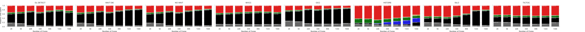
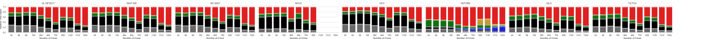
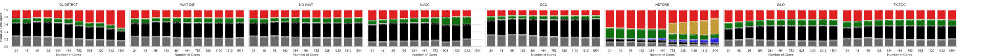
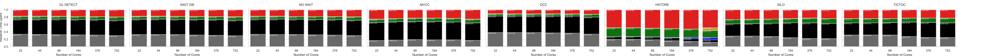

# Time Breakdowns for The Full TPC-C Benchmark — Low Conflict (Section 4.3)

__Intel-based HPE Hardware Platform__

__Power9 Hardware Platform__

Original:

Optimised with replicated internal data structures:

__Power8 Hardware Platform__

